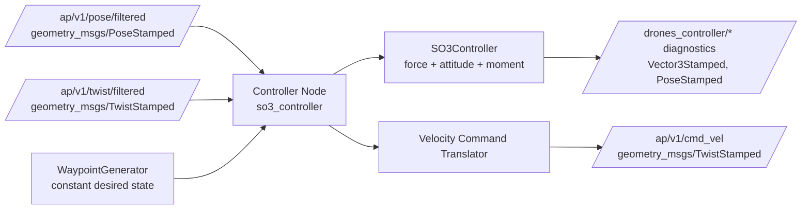
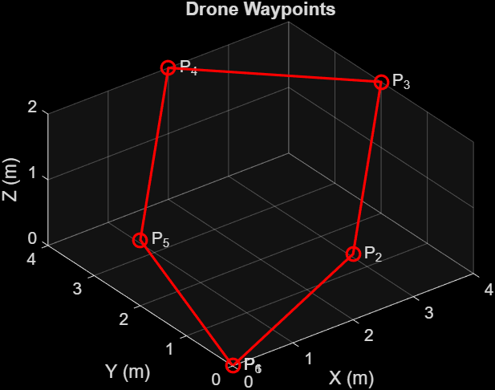
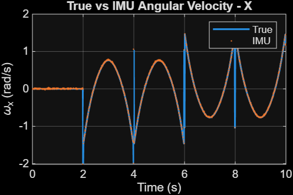
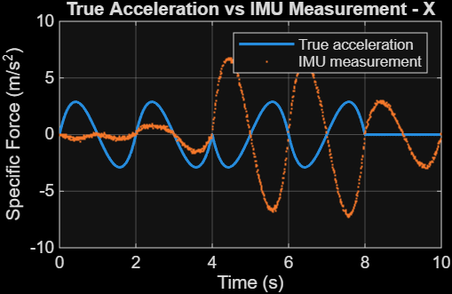
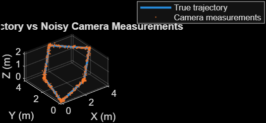

<p align="center">
  
</p>

# $\color{#0B3D91}{\textsf{3D\ MAPPING\ USING\ NORMAL\ MONOCULAR\ CAMERA\ CONTROLLING\ VIO}}$

### *A First-Principles, Euler-Angle-Free Approach for Autonomous Multirotor UAVs*

**Presented by Group CD2**

[](https://docs.ros.org/en/humble/index.html)
[](https://www.python.org/)
[](https://ardupilot.org/dev/docs/sitl-simulator-software-in-the-loop.html)
[](https://gazebosim.org/)
[](https://www.mathworks.com/products/ros.html)
[-1D4ED8)](#methodology)
[](#state--control-parameters)

</div>

---

## Team Members

| Name | Roll Number | Email |
|---|---|---|
| **Ravishanmugam K** | `CB.SC.U4AIE24347` | `ravish2007801@gmail.com` |
| **Ishwarya M** | `CB.SC.U4AIE24220` | `ishwarya15m@gmail.com` |
| **Aparna B** | `CB.SC.U4AIE24304` | `aparnabharani2006@gmail.com` |
| **Cibikumar B** | `CB.SC.U4AIE24212` | `cibikumar30@gmail.com` |
| **Akhilan S** | `CB.SC.U4AIE24362` | `akhilan1010@gmail.com` |

---

## Table of Contents

- [Abstract](#abstract)
- [Introduction](#introduction)
- [Methodology](#methodology)
- [3D Mapping & VIO Pipeline](#3d-mapping--vio-pipeline)
- [State & Control Parameters](#state--control-parameters)
- [Comparative Analysis](#comparative-analysis)
- [Results](#results)
- [Conclusion](#conclusion)
- [References](#references)
- [Project Tree](#project-tree)

---

## Abstract

This repository presents a first-principles multirotor control workflow centered on geometric attitude control in $SO(3)$ and quaternion-based orientation handling, implemented as a ROS 2 Python package (`drones_controller`) and supported by MATLAB live scripts (`Toy Model/`). The controller consumes filtered pose/twist state streams from an ArduPilot SITL + Gazebo simulation setup and computes force/moment-level geometric control quantities along with commandable velocity outputs.

The project direction targets monocular-camera-driven VIO and 3D mapping; however, in the current repository snapshot, those perception modules are represented as project scope/results context rather than fully implemented ROS 2 mapping nodes. This keeps claims aligned with available implementation artifacts.

[IMPORTANT]
> The controller avoids Euler-angle internal attitude feedback and uses rotation matrices/quaternions to avoid gimbal-lock singularities in the control law.

---

## Introduction

Multirotor UAV dynamics are nonlinear, coupled, and underactuated: translational tracking and attitude dynamics cannot be treated as independent in aggressive or disturbance-rich maneuvers. Classical Euler-angle pipelines are practical but can suffer singularity issues that complicate globally consistent control analysis.

This project adopts a geometric control formulation in $SO(3)$ and quaternion-based state conversion, implemented in `drones_controller/drones_controller/so3_controller.py`, `state_adapter.py`, and `controller_node.py`. The architecture is organized around ArduPilot SITL state topics, ROS 2/DDS transport, and Gazebo-based simulation.

MATLAB Live Scripts in `Toy Model/` provide a structured progression (waypoints, trajectory, synthetic sensing, state estimation, SO(3) controller, dynamics, and final results), complementing the ROS 2 controller implementation.

---

## Methodology

### 1) Position Control

The controller computes translational tracking errors from desired and measured states:

$$
\mathbf{e}_x = \mathbf{x}_d - \mathbf{x}, \qquad
\mathbf{e}_v = \mathbf{v}_d - \mathbf{v}
$$

and desired force (ENU-adapted implementation):

$$
\mathbf{F}_d = m\left(K_p\mathbf{e}_x + K_v\mathbf{e}_v + \mathbf{a}_d + g\mathbf{e}_3\right)
$$

### 2) Desired Attitude Construction

The force direction defines the target body $b_3$ axis:

$$
\mathbf{b}_{3d}=\frac{\mathbf{F}_d}{\|\mathbf{F}_d\|}
$$

Using desired yaw heading, orthonormal body axes are constructed and stacked as $R_d \in SO(3)$.

### 3) Geometric Attitude Control

Attitude and angular-rate errors:

$$
\mathbf{e}_R = \frac{1}{2}(R_d^TR - R^TR_d)^\vee,
\qquad
\mathbf{e}_{\Omega} = \Omega - R^TR_d\Omega_d
$$

Implemented moment control law (`compute_moment`):

$$
\mathbf{M}_d = -K_R\mathbf{e}_R - K_\Omega\mathbf{e}_{\Omega} + \mathbf{\Omega} \times (J\mathbf{\Omega}) - J\left(\hat{\mathbf{\Omega}} R^T R_d \mathbf{\Omega}_d - R^T R_d \dot{\mathbf{\Omega}}_d\right)
$$

### 4) Command Interface / Allocation Path

The node publishes geometric diagnostics (desired force/moment, attitude error, etc.) and translates position/velocity intent to bounded `/ap/v1/cmd_vel` velocity commands for the current ArduPilot interface.



[!NOTE]
> In the current implementation, dedicated estimator and actuator-bridge ROS 2 nodes are not separate packages; the controller consumes filtered state from ArduPilot topics and publishes command/diagnostic topics.

---

## 3D Mapping & VIO Pipeline

### Implemented in this repository
- Geometric control pipeline with quaternion/SO(3) attitude handling.
- ROS 2 topic-level integration for filtered state + velocity command output.
- MATLAB staged workflow (`step1` ... `step7`) for trajectory/control experimentation.

### Targeted / referenced project direction
- **Visual Input:** monocular camera observations.
- **IMU + VIO fusion:** state estimation for $(x,y,z)$ and orientation.
- **SLAM / 3D mapping:** environment reconstruction pipeline.

[!TIP]
> The repository title and `Results/` artifacts indicate mapping/VIO scope, but no dedicated ROS 2 VIO/SLAM package (e.g., OctoMap/Voxblox node integration) is currently committed here.

---

## State & Control Parameters

| Category | Parameters |
|---|---|
| Position | $(x, y, z)$ |
| Orientation | Quaternion $q$ / $R \in SO(3)$ |
| Linear Velocity | $(\dot{x}, \dot{y}, \dot{z})$ |
| Angular Velocity | $(\Omega_x, \Omega_y, \Omega_z)$ |
| Camera | Monocular stream (project scope) |
| Control | Desired force $\mathbf{F}_d$, desired moment $\mathbf{M}_d$, bounded velocity command |
| Estimation | Filtered pose/twist from ArduPilot topics |
| Communication | ROS 2 (DDS transport), ArduPilot interface topics |

**Configured controller parameters** (`drones_controller/config/controller.yaml`):
`mass`, `gravity`, `kp`, `kv`, `kR`, `kOmega`, `inertia`, `max_velocity`, `state_timeout`, `control_rate`, and desired position/yaw setpoints.

---

## Comparative Analysis

| Feature | Existing/Base Work | Proposed Work in This Repository |
|---|---|---|
| Control | Conventional flight-stack interaction | Custom nonlinear geometric control core in $SO(3)$ + quaternion conversions |
| Architecture | Less modular control experimentation | ROS 2 package (`drones_controller`) + MATLAB staged workflow |
| Attitude Representation | Often Euler-angle-centric in practical stacks | Rotation matrix + quaternion internal handling |
| Mapping Scope | Monocular visual reconstruction baseline direction | Mapping/VIO objective stated; controller implementation is currently the strongest committed component |
| Communication | Platform-specific interfaces | ROS 2/DDS topic interfaces with ArduPilot SITL/Gazebo state exchange |
| Simulation | Base setup context | Explicit ArduPilot SITL + Gazebo + ROS 2 controller linkage |

---

## Results

### Repository result images (available in `Results/`)

| Preview | File |
|---|---|
|  | `Results/image1.png` |
|  | `Results/image2.png` |
|  | `Results/image3.png` |
|  | `Results/image4.png` |

Additional files in the same folder include `image5.png`, `image6.png`, `image22.jpeg`, and multiple `untitled*.png`/`untitled*.jpeg` captures.

[video.webm](https://github.com/user-attachments/assets/0ed8133c-c115-4816-8c9a-0bfaf4fb959b)

Video reference provided by the team: [Project Video](https://drive.google.com/drive/folders/1iowpdHYk4qTKaGRoWc7l1Y_70IvifeuA?usp=sharing)

---

## Conclusion

The repository establishes a modular foundation around:

$$
\boxed{\text{3D Mapping Scope} + \text{VIO Scope} + SO(3) + \text{Quaternions} + \text{Autonomous Control}}
$$

with practical simulation/control integration through Gazebo, ArduPilot SITL, ROS 2/DDS messaging, and MATLAB-assisted experimentation. Current committed implementation is strongest on geometric control and simulation interfacing, while perception-heavy mapping/VIO components remain an explicit project direction.

---

## References

1. **Base Paper (repository file):** [Base Paper.pdf](https://github.com/Ravish2807/Drones_S5_CD2_3D_Mapping_using_normal_monocular_camera_controlling_Visual-Inertial-Odometry-VIO/blob/main/Base%20Paper.pdf)
2. Lee, T., Leok, M., McClamroch, N. H. *Geometric Tracking Control of a Quadrotor UAV on SE(3)* — [arXiv](https://arxiv.org/abs/1003.2005)
3. Quaternion attitude representation overview — [Placeholder URL](<URL placeholder>)
4. VIO literature (VINS-Mono) — [arXiv](https://arxiv.org/abs/1708.03852)
5. SLAM literature (ORB-SLAM2) — [GitHub](https://github.com/raulmur/ORB_SLAM2)
6. ArduPilot SITL documentation — [ardupilot.org](https://ardupilot.org/dev/docs/sitl-simulator-software-in-the-loop.html)
7. ROS 2 Humble documentation — [docs.ros.org](https://docs.ros.org/en/humble/index.html)
8. Gazebo documentation — [gazebosim.org](https://gazebosim.org/docs)
9. MATLAB ROS Toolbox documentation — [mathworks.com](https://www.mathworks.com/help/ros/)
10. MAVLink protocol documentation — [mavlink.io](https://mavlink.io/en/)
11. DROID-SLAM (if integrated in future perception stack) — [GitHub](https://github.com/princeton-vl/DROID-SLAM)
12. OctoMap (mapping reference) — [octomap.github.io](https://octomap.github.io/)
13. Voxblox (mapping reference) — [GitHub](https://github.com/ethz-asl/voxblox)

---

## Project Tree

```text
├── Base Paper.pdf
├── LICENSE
├── README.md
├── Results/
│   ├── image1.png
│   ├── image2.png
│   ├── image22.jpeg
│   ├── image3.png
│   ├── image4.png
│   ├── image5.png
│   ├── image6.png
│   └── untitled*.png/jpeg
├── Toy Model/
│   ├── step1_waypoints.mlx
│   ├── step2_trajectory.mlx
│   ├── step3_synthetic_sensors.mlx
│   ├── step4_state_estimation.mlx
│   ├── step5_so3_controller.mlx
│   ├── step6_drone_dynamics.mlx
│   └── step7_final_results.mlx
└── drones_controller/
    ├── README.md
    ├── package.xml
    ├── setup.py
    ├── setup.cfg
    ├── config/
    │   └── controller.yaml
    └── drones_controller/
        ├── __init__.py
        ├── controller_node.py
        ├── so3_controller.py
        ├── state_adapter.py
        ├── teleop.py
        └── trajectory_generator.py
```

---

<div align="center">

**Amrita Vishwa Vidyapeetham · Group CD2 · Autonomous UAV Control & Mapping Research**

</div>
